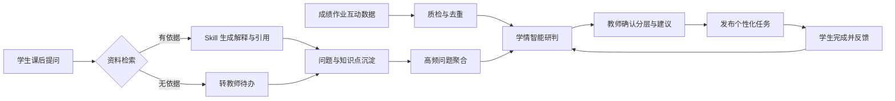
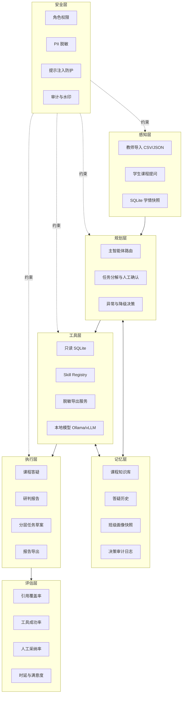
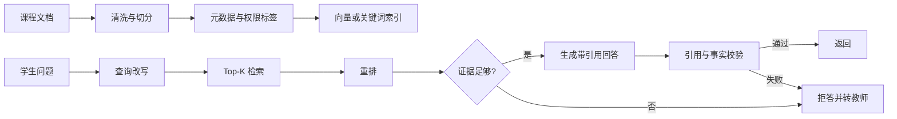
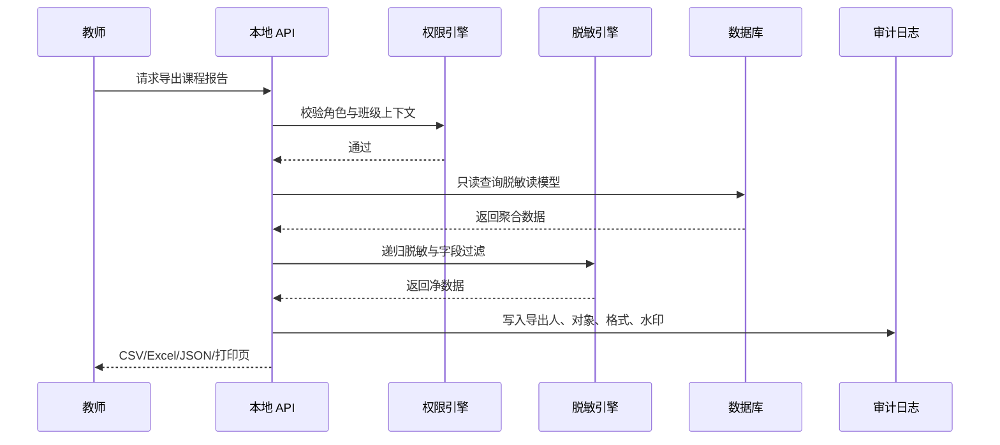
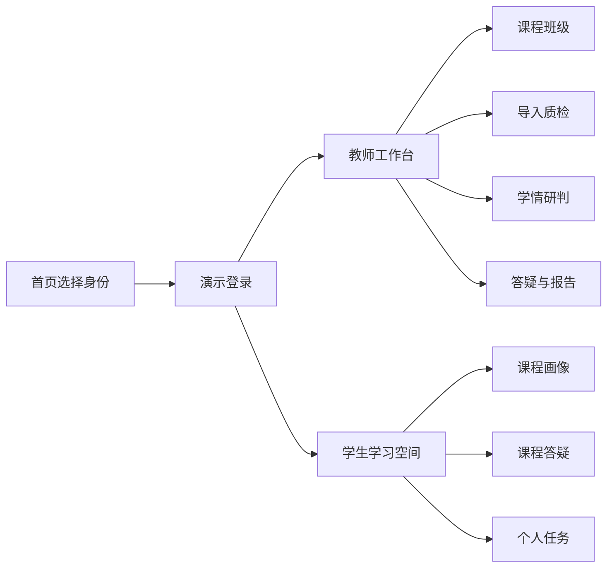
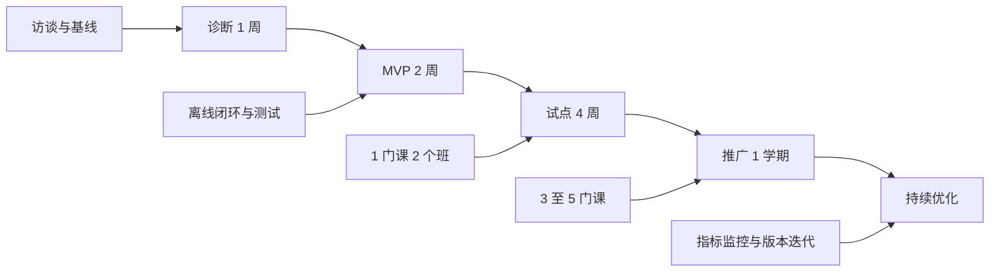

# 智学双擎参赛优化方案

> 版本：2026-09-14.v1  
> 定位：教师教学与学生学习的轻量化智能辅助 MVP  
> 核心场景：课后即时答疑 + 学情智能研判  
> 默认原则：本地优先、数据最小化、教师确认、异常可降级

## 0. 澄清问题

当前信息足以进入方案和实施。以下为实施假设，不需要等待澄清：

1. 赛题方未给出 OpenClaw 具体发行版的私有 Schema，因此仓库提供语义完整的兼容配置，并通过适配器映射平台字段。
2. 当前数据为匿名合成数据，用于演示真实教学闭环；真实院校数据接入时必须重新签署授权并完成分级分类。
3. MVP 部署目标是单机、内网、可断网运行，不依赖公网模型、云数据库或短信服务。
4. 演示身份用于功能验收，不等同于生产级统一身份认证。生产版应接入 CAS/OAuth2/SAML。
5. 视频、PPT 和软著等提交材料由项目组根据本仓库脚本与大纲录制、排版。

真正需要项目组补充的信息见第 20 节，不阻塞代码验收和演示。

## 1. 赛题解读与评分策略

| 评分项 | 分值 | 得分关键 | 本项目对应策略 | 当前差距 |
|---|---:|---|---|---|
| 场景适配性 | 30 | 紧贴教学流程、岗位任务真实、闭环完整 | 聚焦教师学情研判与学生课后答疑，数据、研判、任务、反馈回流形成闭环 | 仍需补充一所真实院校的流程访谈记录 |
| 功能实用性 | 25 | 减负增效明确、结果可用、替代重复劳动 | 自动质检、班级画像、薄弱点排序、答疑引用、高频问题聚合、脱敏导出 | 真实模型和课程资料仍需接入 |
| 操作便捷性 | 15 | 三步完成任务、少输入、结果可编辑 | 教师登录后 3 步完成研判；学生输入问题即可得到带引用回答 | 登录、导入和导出仍需做真实用户可用性测试 |
| 代码规范性 | 15 | 分层、注释、接口、测试、可维护 | Skill 独立目录、标准化 JSON、本地 API、错误码、自动测试、配置分层 | `assets/app.js` 仍偏大，后续应拆成 3 至 4 个前端模块 |
| 异常处理能力 | 10 | 数据、网络、模型、权限、工具异常均可恢复 | 数据质检、静态快照、本地规则 Skill、任务转人工、导出熔断、审计日志 | 尚未实现多进程持久任务队列 |
| 文档完整性 | 5 | 材料齐全、部署可复现、说明清晰 | README、部署手册、提示词、OpenClaw 配置、测试、视频脚本、PPT 大纲 | 最终视频和 PPT 文件仍需制作 |

### 评分策略

1. 场景分优先：登录页直接呈现“教师工作台”和“学生学习空间”，不展示无关的校园大平台功能。
2. 功能分靠闭环：学情研判不只看分，还回流到分层任务；答疑不只回答，还进入高频问题与教师反馈。
3. 便捷分靠三步：教师“选班级 → 确认数据 → 生成研判”，学生“选课程 → 提问 → 查看引用”。
4. 代码分靠边界：所有 AI 能力有标准输入输出、错误状态和测试用例，不让模型直接操作数据库。
5. 异常分靠兜底：模型不可用时走规则 Skill，数据库不可用时走同源快照，工具失败时转人工。
6. 文档分靠可复制：所有命令都可在 Windows、Linux 或 Docker 中执行。

## 2. 场景选择与用户画像

### 推荐核心场景

| 场景 | 选择理由 | MVP 功能 | 扩展边界 |
|---|---|---|---|
| 课后即时答疑 | 学生需求高频、演示稳定、可量化引用与转人工 | 课程资料检索、依据回答、引导追问、资料不足转教师 | 多课程知识库、语音提问、错题自动绑定 |
| 学情智能研判 | 教师痛点强、数据基础已具备、可连接教学决策 | 数据质检、班级画像、薄弱点、分层建议、脱敏导出 | 学期趋势、跨班对比、预警干预闭环 |

不把“行政事务智能处理”和“办公内容规整”作为本次主场景，但保留可插拔接口。两大主场景已经覆盖教师教学与学生学习的核心闭环，避免堆功能导致演示不稳定。

### 目标用户画像

| 用户 | 典型岗位 | 使用频次 | 现有流程 | 当前耗时 | 主要痛点 |
|---|---|---|---:|---:|---|
| 任课教师 | 计算机、人工智能等专业教师 | 每周 3 至 5 次 | 导出成绩、手工透视、翻看作业、整理提问 | 每班 120 至 240 分钟 | 数据分散、分层凭经验、课后答疑重复 |
| 学生 | 高职或本科生 | 每周 3 至 10 次 | 查课件、问同学、等教师回复 | 每题 10 分钟至 1 天 | 个性化支持不足、答案缺少依据 |
| 教学负责人 | 教研室主任、课程负责人 | 每月 1 至 2 次 | 收集班级报告、人工汇总 | 每轮 1 至 2 天 | 口径不统一、过程事实难追溯 |
| 管理员 | 信息中心、教务管理员 | 按需 | 维护账号、数据、权限和导出 | 持续投入 | 权限、审计、脱敏与本地部署复杂 |

### 使用频次与成功标准

| 场景 | 频次目标 | 成功标准 |
|---|---|---|
| 课后答疑 | 每课程每周不少于 50 次 | 80% 以上常见问题在 15 秒内生成带引用回答；无依据问题 100% 转人工 |
| 学情研判 | 每次测验或作业后 | 教师 3 步内生成班级画像；关键结论均有样本量与证据 |
| 高频问题治理 | 每周或每单元 | 50 条提问 5 分钟内完成分类、聚合和 FAQ 草案 |
| 数据导出 | 每次教研或复盘 | 先鉴权、再脱敏、后水印，审计记录可追溯 |

### 场景流程图



## 3. 痛点-功能-价值映射

| 岗位 | 痛点 | AI 功能 | 人工替代点 | 预计节省时间 | 成功标准 |
|---|---|---|---|---:|---|
| 教师 | 成绩、作业、互动数据分散 | 多源数据质检与合并 | 人工查找空值、重复和异常 | 每班每次 20 至 40 分钟 | 空值、重复、越界、格式错误全部显式提示 |
| 教师 | 薄弱知识点识别依赖经验 | 学情智能研判 | 手工透视、排序和归因 | 每班每次 60 至 120 分钟 | 每项结论附样本量、指标和口径 |
| 教师 | 分层任务制作耗时 | 分层建议与任务草案 | 按组编辑任务、调整难度 | 每次 30 至 60 分钟 | 教师确认后一键发布 |
| 教师 | 重复问题占用大量时间 | 高频问题聚合与 FAQ | 翻聊天、归并同类问题、统一答复 | 每周 40 至 90 分钟 | 输出主题、数量、代表问题和回复草案 |
| 学生 | 课后无人即时答疑 | 课程资料智能答疑 | 等待教师或自行搜索 | 每题 10 至 30 分钟 | 15 秒内作答，引用可定位，无依据转人工 |
| 学生 | 不知道该补什么 | 个体画像与个性化任务 | 教师逐人建议 | 每人每次 10 至 20 分钟 | 当前薄弱点与下一步任务明确 |
| 管理员 | 数据导出存在泄露风险 | 权限校验、脱敏、水印、审计 | 人工删列、发文件、登记台账 | 每次 10 至 20 分钟 | 导出人、范围、格式、水印、时间可追溯 |

时间数据为基于真实高校常见流程的估算，不是已完成的对照组实验。试点阶段需要记录基线。

## 4. 总体架构



### 本地部署与降级标记

| 能力 | 本地实现 | 断网降级 | 人工接管点 |
|---|---|---|---|
| 数据读取 | Node `node:sqlite` 只读连接 | 读取 `assets/demo-data.json` 同源快照 | 数据缺失时教师重新导入 |
| 课程答疑 | 本地 Skill + 课程知识片段 | 规则检索与模板回答 | 资料不足转教师待办 |
| 学情研判 | 本地规则算法 | 使用最近一次快照 | 教师确认建议后才发布 |
| 模型回答 | Ollama/vLLM 可选 | 停用模型，保留 Skill 输出 | 低置信度转人工 |
| 导出 | 本地 API 生成 CSV/Excel/JSON/打印页 | 使用浏览器当前页面快照 | 权限或脱敏失败时阻止导出 |
| 审计 | 本地 JSONL 追加日志 | 内存队列暂存后重试 | 连续失败告警管理员 |

## 5. 智能体与 Skill 设计

### 主智能体与子智能体

| 类型 | 标识 | 职责 | 禁止事项 |
|---|---|---|---|
| 主智能体 | `zhixue-orchestrator` | 识别意图、选择 Skill、控制确认点、处理降级 | 不直接改成绩、不自动发布、不暴露敏感数据 |
| 子智能体 | `learning-analyst` | 学情计算、分层和依据整理 | 不推断家庭、心理等敏感属性 |
| 子智能体 | `course-tutor` | 课程资料答疑、引用和追问 | 无依据不回答 |
| 子智能体 | `answer-manager` | 高频问题聚合、FAQ 和辅导主题 | 不自动发送班级答复 |
| 安全服务 | `guardrail-engine` | 权限、脱敏、注入、水印和审计 | 不参与教学内容生成 |

### 轻量化 Skill

| Skill | 输入 | 输出 | 异常规则 |
|---|---|---|---|
| `course-ai-tutor` | 问题、课程、知识库、层次 | 状态、回答、关联知识、追问 | 无匹配资料返回待人工处理 |
| `academic-performance-analyzer` | 成绩、知识点、考试/班级参数 | 班级概览、知识点、分层、建议 | 缺数据返回澄清问题 |
| `classroom-interaction-generator` | 知识点 | 互动轮次、追问、活动 | 参数为空使用当前知识点并提示 |
| `course-content-optimizer` | 大纲、薄弱点、反馈 | 内容变更、章节、案例、考核和计划 | 缺依据返回澄清问题 |
| `teacher-answer-manager` | 问题记录、既有 FAQ | 聚合、统一答复、FAQ、重点辅导 | 空记录返回澄清问题 |

### 能力矩阵

| Skill | 感知 | 规划 | 记忆 | 工具 | 执行 | 评估 | 反思 |
|---|---|---|---|---|---|---|---|
| 学情研判 | 成绩、作业、互动 | 指标与分层规则 | 班级快照 | SQLite 只读 | 输出报告草案 | 样本量、阈值 | 教学后复测 |
| 课程答疑 | 学生问题 | 检索与回答策略 | 课程知识库 | RAG/关键词检索 | 带引用回答 | 引用覆盖 | 高频问题回流 |
| 课堂互动 | 薄弱知识点 | 活动编排 | 课堂记录 | 非必需 | 互动方案 | 快测结果 | 调整难度 |
| 内容迭代 | 薄弱点与反馈 | 优先级规划 | 课程版本 | 文档工具 | 修订草案 | 掌握度变化 | 下一轮迭代 |
| 答疑管理 | 问题列表 | 聚类与优先级 | FAQ | 聚合服务 | FAQ 草案 | 处理时长 | 统一答复复盘 |

### OpenClaw 配置

完整配置见 `openclaw/zhixue.yaml`，包含：

- Agent：主智能体与专业子智能体。
- Workflow：`after_class_loop` 课后闭环。
- Tool：只读 SQLite、五个 Skill、受控导出。
- Memory：课程知识、答疑历史、班级画像、决策日志。
- Guardrails：权限、脱敏、注入、人工确认、降级与审计。

### AI Coding 模块契约

```ts
type Result<T> =
  | { ok: true; data: T; traceId: string }
  | { ok: false; code: ErrorCode; message: string; retryable: boolean; traceId: string };

interface TutorInput {
  studentQuestion: string;
  courseName: string;
  knowledgeBaseRefs: string[];
  studentLevel: "基础" | "普通" | "优秀";
}

interface AnalystInput {
  className: string;
  examName: string;
  scores: Array<{ anonymousId: string; score: number }>;
  knowledgePoints: Array<{ name: string; masteryRate: number }>;
}
```

代码规范：

- TypeScript 使用严格模式，业务对象必须显式建模。
- 错误码使用稳定枚举，不把模型自由文本当错误协议。
- 日志使用结构化 JSON，字段至少包含 `traceId`、`actorRole`、`action`、`result`、`durationMs`。
- 函数注释说明输入、输出、异常和安全边界，不写重复叙述。

## 6. 核心工作流

### 6.1 课后即时答疑

| 环节 | 内容 |
|---|---|
| 输入 | 学生问题、课程、章节、可选匿名学号 |
| 处理 | 注入检测、PII 脱敏、课程检索、Skill 回答、引用校验 |
| 输出 | 已解答或待人工处理、回答、关联知识、引导问题 |
| 人工确认 | 资料不足、敏感问题、连续低置信度、学生主动申请教师回复 |
| 异常 | 空问题拒绝；模型超时用规则 Skill；检索为空转教师 |

### 6.2 学情智能研判

| 环节 | 内容 |
|---|---|
| 输入 | 匿名成绩、作业、互动、知识点、考勤、答疑标签 |
| 处理 | 字段校验、异常标记、指标计算、分层、建议生成 |
| 输出 | 班级概览、知识点排行、分层草案、教学建议、依据 |
| 人工确认 | 分层阈值、学生风险标签、教学建议发布 |
| 异常 | 空数据回澄清；样本小于 10 标注参考；重复数据去重后保留记录 |

### 6.3 课堂互动赋能

| 环节 | 内容 |
|---|---|
| 输入 | 薄弱知识点、班级规模、课堂时长 |
| 处理 | 生成独立思考、小组协作、全班展示和快测环节 |
| 输出 | 互动方案、追问、活动规则和材料清单 |
| 人工确认 | 教师调整目标和时长后使用 |
| 异常 | 无知识点时使用当前最薄弱点；超时则压缩轮次 |

### 6.4 课程内容迭代

| 环节 | 内容 |
|---|---|
| 输入 | 课程大纲、薄弱点、学生反馈、教师备注 |
| 处理 | 定位薄弱章节，生成补充、调整、案例和考核修改草案 |
| 输出 | 内容变更、章节调整、案例更新、实施计划 |
| 人工确认 | 所有课程内容修订均由课程负责人确认 |
| 异常 | 缺大纲或薄弱点时返回澄清，不凭空改课 |

### 6.5 行政事务智能处理

| 环节 | 内容 |
|---|---|
| 输入 | 流程表单、通知草稿、会议材料清单 |
| 处理 | 字段校验、流程节点识别、待办拆分、责任与截止时间提取 |
| 输出 | 规范表单、待办清单、风险提醒 |
| 人工确认 | 涉及审批、人员通知、对外文件时确认 |
| 异常 | 字段缺失回退人工；权限不足拒绝；重复提交去重 |

### 6.6 办公内容规整

| 环节 | 内容 |
|---|---|
| 输入 | 会议记录、通知、表格、教学文档 |
| 处理 | 去重、结构整理、术语统一、敏感字段脱敏、模板套用 |
| 输出 | 规范文档、摘要、待办、导出文件 |
| 人工确认 | 对外发布、人员名单、正式发文前确认 |
| 异常 | 格式错误保留原文定位；文档超大按页或章节分批 |

### 回滚策略

- 数据导入：保留批次号，回滚只撤销该批次对应记录。
- 任务发布：保留版本号，教师可撤回后恢复上一版任务。
- 课程迭代：原始大纲只读，修改写入新版本。
- 导出：不修改源数据，失败只删除临时文件并记录审计。

## 7. 提示词工程

可直接复制的完整提示词位于：

- `prompts/system.md`：系统边界和角色。
- `prompts/task-teaching-loop.md`：教学闭环任务。
- `prompts/tool-calls.md`：工具调用规则。
- `prompts/refusal.md`：拒答和替代路径。
- `prompts/redaction.md`：数据脱敏规则。

版本管理：

- 每个提示词首行记录用途、版本和负责人。
- 发布号由“提示词版本 + 模型版本 + 知识库版本”组成。
- 提示注入、无依据回答、越权导出属于强制回归项。

## 8. 数据与知识库

### 知识库分类

| 类别 | 示例 | 元数据 | 权限标签 |
|---|---|---|---|
| 课程讲义 | PDF、Markdown | 课程、章节、页码、版本、知识点 | 学生、教师 |
| 课件 | PPT/HTML | 课程、单元、页码、更新时间 | 学生、教师 |
| 例题与解析 | 题目、答案、步骤 | 难度、知识点、来源 | 学生、教师 |
| 作业评分标准 | Rubric | 课程、任务、权重 | 教师 |
| 教师备注 | 课堂观察、待改进点 | 课程、班级、时间 | 教师 |
| 行政制度 | 流程、表单 | 部门、版本、生效日期 | 按角色 |

其表示例：

```json
{
  "docId": "ai201-ch4-p22",
  "course": "人工智能导论",
  "chapter": "模型评估",
  "knowledgePoints": ["精确率", "召回率", "F1"],
  "page": "22-24",
  "version": "2026.08",
  "visibility": ["student", "teacher"],
  "sourceHash": "sha256:..."
}
```

### RAG 流程



### 切分与检索

- 讲义按标题层级和语义段落切分，单块 500 至 800 中文字。
- 表格按表头重复，公式、代码和例题保持完整。
- 元数据必须包含课程、章节、知识点、页码、版本和权限。
- MVP 使用可解释关键词匹配；进阶使用 SQLite FTS5 + BGE-M3 向量召回 + Cross Encoder 重排。
- Top-K 默认 5，重排后保留 3 条，低于证据阈值不生成事实结论。

### 数据更新与导出

- 原始数据只读，新数据生成新版本和来源哈希。
- 每次导入写 `data_import_batches` 与质量检查结果。
- 导出支持 CSV、Excel 兼容 XML、JSON，PDF 通过本地打印页另存。
- 导出前递归脱敏，保留水印和审计记录。
- 导出范围默认不含原始作答正文、教师备注和未发布的个体标签。

### 本地模型选型

| 场景 | 推荐 | 原因 |
|---|---|---|
| 低成本演示 | Ollama + Qwen2.5 7B Instruct | 安装简单、中文可用、可在单机运行 |
| 校园并发 | vLLM + Qwen2.5 14B/32B | 吞吐与并发更好，需 GPU |
| 向量库 | MVP 用内存或 SQLite；进阶 Chroma/Qdrant | 先满足离线演示，再支持规模增长 |
| 重排 | BGE-reranker-base | 提升引用准确率，可独立降级 |
| 嵌入 | BGE-M3 或校方已备案模型 | 中文与多粒度检索表现稳定 |

## 9. 安全合规与权限

### 角色权限矩阵

| 能力 | 学生 | 教师 | 行政 | 管理员 |
|---|---|---|---|---|
| 查看个人画像 | 本人 | 所授班级 | 无 | 受控审计 |
| 查看班级画像 | 禁止 | 所授班级 | 授权范围 | 全局统计 |
| 发起课程答疑 | 允许 | 允许 | 课程范围内 | 允许 |
| 发布任务 | 禁止 | 所授课程 | 禁止 | 应急处置 |
| 修改课程内容 | 禁止 | 提交草案 | 禁止 | 版本恢复 |
| 导出个人记录 | 本人脱敏 | 所授班级 | 业务范围 | 全量审计 |
| 查看审计日志 | 禁止 | 本人操作 | 本人流程 | 允许 |
| 管理模型与知识库 | 禁止 | 禁止 | 业务知识 | 允许 |

### 安全措施

| 风险 | 控制 |
|---|---|
| PII 泄露 | 字段白名单、递归脱敏、匿名编号、导出水印 |
| 越权 | 角色和课程上下文双重校验，拒绝客户端自报管理员 |
| 提示注入 | 系统提示隔离、输入模式检测、工具参数白名单 |
| 数据泄露 | 本地部署、网络默认关闭、日志脱敏、导出审计 |
| 幻觉误导 | 引用门禁、证据阈值、低置信度转人工 |
| 不当标签 | 不生成心理、家庭、经济等敏感推断 |
| 误操作 | 高风险动作二次确认、版本快照、撤回窗口 |
| 内部滥用 | 操作者、时间、对象、结果、水印全链路记录 |

### 数据安全导出



## 10. 界面与交互原型

### 页面结构



### 核心任务三步内完成

| 用户 | 第一步 | 第二步 | 第三步 |
|---|---|---|---|
| 教师 | 选择课程和班级 | 载入或上传匿名数据并确认质检 | 生成研判、确认建议、导出报告 |
| 学生 | 选择课程 | 输入问题 | 查看回答与引用，必要时转教师 |

### 原型说明

| 页面 | 关键元素 | 交互要点 |
|---|---|---|
| 首页 | 双角色入口、六步闭环、数据安全说明 | 点击角色直接进入对应登录参数 |
| 任务页 | 大按钮、模板化输入、少量字段 | 默认填充示例但允许教师编辑 |
| 结果页 | 摘要、证据、分层、建议、Skill 状态 | 事实与建议分开，显示更新时间 |
| 学生答疑页 | 大输入框、快捷问题、引用来、追问卡片 | `Ctrl+Enter` 发送，资料不足显示转人工状态 |
| 导出页 | 导出类型、格式、审计提示 | 导出前显示脱敏说明，失败不泄露技术堆栈 |

设计约束：

- 页面不显示 API Key、数据库路径或内部错误堆栈。
- 不展示班级排名，避免强化标签效应。
- 结论区优先显示“依据”和“待教师确认”状态。
- 移动端保持单列，按钮不因动态文本换行而挤压。
- 所有核心点击控件保留明显焦点和可读错误信息。

## 11. 代码工程结构

```text
zhixue-dual-engine-frontend/
├─ assets/
│  ├─ app.js                         # 页面交互与本地回退
│  ├─ demo-data.json                 # 脱敏读模型
│  ├─ style.css
│  └─ skills/
│     ├─ skill-registry.js
│     ├─ course-ai-tutor.js
│     ├─ academic-performance-analyzer.js
│     ├─ classroom-interaction-generator.js
│     ├─ course-content-optimizer.js
│     └─ teacher-answer-manager.js
├─ server/
│  ├─ local-api.mjs                  # 本地 API、静态白名单、导出与审计
│  └─ skill-runtime.cjs              # 隔离加载 Skill
├─ data/
│  ├─ zhixue_demo.sqlite             # 匿名完整库，只读
│  ├─ web_snapshots.json
│  └─ runtime/audit.jsonl            # 运行时审计日志
├─ openclaw/
│  ├─ zhixue.yaml                    # Agent/Workflow/Tool/Memory/Guardrails
│  └─ README.md
├─ prompts/                           # 可复制提示词与版本规则
├─ docs/                              # 方案、部署、测试、视频和 PPT
├─ scripts/
│  ├─ start-zhixue.ps1
│  ├─ start-zhixue.sh
│  └─ backup-local.ps1
├─ tests/
│  ├─ local-api.test.mjs
│  └─ pages.test.mjs
├─ Dockerfile
├─ compose.yaml
├─ package.json
└─ README.md
```

### 模块职责

| 模块 | 职责 | 安全边界 |
|---|---|---|
| `assets/app.js` | 页面路由、状态、表单、结果渲染 | 不持有密钥，不直接读 SQLite |
| `assets/skills` | 标准化 AI 能力 | 不访问网络，不写数据库 |
| `server/local-api.mjs` | API、静态白名单、权限、脱敏、导出、审计 | 数据库只读，不暴露 `data` 目录 |
| `server/skill-runtime.cjs` | 在隔离上下文加载 Skill | 不加载未注册文件 |
| `data` | 匿名样例和运行时日志 | 静态服务不可访问 |
| `openclaw` | 平台语义配置 | 工具权限最小化 |

### 配置、依赖和日志

- 配置：端口、主机、数据库路径通过环境变量或命令行注入。
- 依赖：本地运行只依赖 Node 22.13+ 内置模块，不强制 npm 安装。
- 日志：审计日志使用 JSONL；应用日志不得带姓名、学号、手机号。
- 可观测性：建议增加 `traceId`、耗时、Skill 命中率、导出结果和错误码统计。
- 可扩展点：新增 Skill 只需注册契约；新增数据源通过只读适配器接入；新增导出格式通过格式器扩展。

### 关键代码片段

Skill 注册与统一调用：

```js
const result = ZhixueSkillRegistry.snapshot();
const answer = ZhixueSkillTutor.answer({
  student_question: safeQuestion,
  course_name: courseName
});
```

本地 API 边界：

```js
if (!validateRequestContext(role, context)) {
  return json({ success: false, code: "EXPORT_FORBIDDEN" }, 403);
}
const redacted = redactValue(payload);
await recordAudit({ actorRole: role, action: "export_data" });
```

## 12. 一键部署教程

### README 结构

```text
1. 项目简介与截图
2. 功能范围和演示账号
3. 环境要求
4. Windows 一键启动
5. Linux 一键启动
6. Docker Compose 部署
7. 离线模型接入
8. 停止、升级、备份、恢复
9. 常见错误与排查
10. 测试与验收
```

### Windows

```powershell
cd zhixue-dual-engine-frontend
.\scripts\start-zhixue.ps1
```

浏览器打开：

```text
http://127.0.0.1:8080
```

### Linux

```bash
cd zhixue-dual-engine-frontend
chmod +x scripts/start-zhixue.sh
./scripts/start-zhixue.sh
```

### Docker Compose

```bash
docker compose up -d --build
docker compose ps
docker compose logs -f zhixue
```

停止：

```bash
docker compose down
```

### 内网、无外网与模型本地化

1. 将 Node 或 Docker 镜像、项目包、SQLite 数据一次性拷入内网。
2. 默认启动不访问外网，不执行 npm 安装。
3. 若需大模型，在内网部署 Ollama：

```bash
ollama serve
ollama pull qwen2.5:7b-instruct
```

4. 在 OpenClaw 配置中把模型地址指向 `http://127.0.0.1:11434`。
5. 模型不可用时，系统自动回到本地规则 Skill，核心演示不中断。

### 升级、备份和恢复

升级前备份：

```powershell
.\scripts\backup-local.ps1
```

恢复：

```powershell
Copy-Item .\backups\zhixue_demo-时间戳.sqlite .\data\zhixue_demo.sqlite -Force
```

升级：

```bash
docker compose pull
docker compose up -d --build
```

### 常见部署错误

| 现象 | 原因 | 排查 |
|---|---|---|
| 端口占用 | 8080 已被占用 | 使用 `--port 8081` 或停止占用进程 |
| 数据库打不开 | 文件缺失或权限错误 | 检查 `data/zhixue_demo.sqlite` 是否可读 |
| 页面 404 | 访问了非白名单路径 | 从首页或教师/学生入口进入 |
| 答疑转人工 | 资料无匹配或模型关闭 | 检查课程知识库和 `_refs` |
| 导出 403 | 角色与上下文不匹配 | 教师只能导出 `teacher:*`，学生只能导出本人 |
| Docker 无写权限 | 审计卷不可写 | 检查 `zhixue-runtime` 卷权限 |

## 13. 异常处理与降级

| 类别 | 场景 | 检测 | 处理 | 用户提示 |
|---|---|---|---|---|
| 数据异常 | 空文件 | 行数或数组为空 | 阻断分析 | 未识别到有效数据 |
| 数据异常 | 格式错误 | 字段或类型校验 | 标出行号，可保留其他行 | 发现格式错误，请确认后再分析 |
| 数据异常 | 缺失字段 | 必填字段检查 | 返回缺失字段清单 | 缺少知识点或分数字段 |
| 数据异常 | 重复记录 | 匿名编号加任务编号 | 去重并保留审计 | 已去重，原始记录保留在批次中 |
| 操作失误 | 误删 | 软删除或版本快照 | 限定时间撤回 | 已进入回收状态，可撤销 |
| 操作失误 | 误提交 | 确认页和版本号 | 撤回并恢复上一版 | 已撤回上一版任务 |
| 操作失误 | 权限不足 | 角色与上下文校验 | 拒绝并审计 | 当前身份无权访问该数据 |
| 断网 | 本地服务请求失败 | Fetch 异常 | 使用同源快照和本地 Skill | 已切换到离线模式 |
| 断网 | 模型不可用 | 超时或连接失败 | 规则 Skill | 当前使用本地规则回答 |
| 模型异常 | 超时 | 20 秒阈值 | 重试一次后降级 | 回答较慢，已切换备用模式 |
| 模型异常 | 限流 | 429 | 指数退避和队列 | 当前请求较多，请稍后重试 |
| 模型异常 | 幻觉 | 无引用或引用不匹配 | 拒绝输出，转教师 | 资料不足，已转教师确认 |
| 工具异常 | SQLite 失败 | 只读查询异常 | 读取最近快照 | 数据暂时不可用，正在使用缓存 |
| 工具异常 | 导出失败 | 权限、格式器、写文件异常 | 不导出并审计 | 导出未完成，请联系管理员 |
| 安全异常 | 提示注入 | 规则匹配 | 拒绝和审计 | 请求包含越权指令，已拦截 |

### 错误码表

| 错误码 | HTTP | 含义 | 可重试 | 用户动作 |
|---|---:|---|---|---|
| `EMPTY_QUESTION` | 400 | 问题为空 | 否 | 输入课程问题 |
| `INVALID_JSON` | 400 | JSON 格式错误 | 是 | 检查请求内容 |
| `PAYLOAD_TOO_LARGE` | 400 | 请求体超过 64 KB | 否 | 缩短或拆分内容 |
| `PROMPT_INJECTION_BLOCKED` | 400 | 检测到越权指令 | 否 | 改为合规课程问题 |
| `INVALID_CONTEXT` | 400 | 班级或学生上下文非法 | 否 | 重新选择上下文 |
| `DASHBOARD_NOT_FOUND` | 404 | 无对应脱敏快照 | 是 | 等待数据更新或重新选择 |
| `EXPORT_FORBIDDEN` | 403 | 角色与导出对象不匹配 | 否 | 确认角色和课程权限 |
| `EXPORT_PARAM_INVALID` | 400 | 导出类型或格式不支持 | 否 | 使用页面提供的格式 |
| `EXPORT_DATA_NOT_FOUND` | 404 | 无可导出数据 | 是 | 检查统计周期 |
| `API_NOT_FOUND` | 404 | 接口不存在 | 否 | 使用正式页面入口 |
| `INTERNAL_ERROR` | 500 | 未预期异常 | 是 | 稍后重试并联系管理员 |
| `DATABASE_UNAVAILABLE` | 503 | 数据库不可用 | 是 | 系统会尝试本地快照 |
| `MODEL_TIMEOUT` | 504 | 模型超时 | 是 | 系统自动切换规则 Skill |
| `TOOL_CALL_FAILED` | 502 | 工具调用失败 | 是 | 执行队列重试或人工接管 |

### 降级顺序

1. 在线模型。
2. 本地轻量模型。
3. 确定性 Skill。
4. 模板回复。
5. 教师人工接管。

任何降级都必须保留原因，不把降级结果伪装成正常模型输出。

## 14. 测试与评估

### 指标

| 指标 | 目标 |
|---|---:|
| 学情计算准确率 | 100% 与基准 SQL/手工计算一致 |
| 课程引用召回率 | 常见知识点不低于 90% |
| 无依据回答率 | 0 |
| 答疑任务完成率 | 已解答加正确转人工合计不低于 98% |
| 工具调用成功率 | 正常数据条件下不低于 99% |
| 首字响应时延 | 规则 Skill 小于 1 秒，模型小于 8 秒 |
| 单千次任务成本 | 本地模型可核算电力和折旧，不依赖外部 API |
| 教师采纳率 | 试点不低于 70% |
| 用户满意度 | 5 分制不低于 4.2 |

### 核心测试用例

| 编号 | 类型 | 输入 | 预期 |
|---|---|---|---|
| T01 | 正常 | 精确率与召回率问题 | 返回已解答和引用 |
| T02 | 正常 | 模型评估班级数据 | 返回知识点、分层和建议 |
| T03 | 正常 | CSV 无异常 | 质检通过并可研判 |
| T04 | 边界 | 样本数 9 | 标注样本较少，仅供参考 |
| T05 | 边界 | 分数 0 和 100 | 边界正确计入通过率 |
| T06 | 边界 | 问题 500 字 | 可正常处理，不截断语义错误 |
| T07 | 异常 | 空问题 | 返回 `EMPTY_QUESTION` |
| T08 | 异常 | 损坏 JSON | 返回 `INVALID_JSON` |
| T09 | 异常 | 维度缺失 | 返回澄清清单 |
| T10 | 异常 | 重复学生记录 | 去重并保留质量记录 |
| T11 | 异常 | 分数 118 | 标为范围异常并阻断或要求确认 |
| T12 | 权限 | 学生导出班级报告 | 返回 403 |
| T13 | 权限 | 教师导出非所授班级 | 应拒绝，生产版需补真实关系校验 |
| T14 | 隐私 | 问题包含手机号 | 脱敏后处理，日志不保留原值 |
| T15 | 隐私 | 导出含姓名与学号 | 替换为脱敏标记 |
| T16 | 安全 | 提示注入 | 返回 `PROMPT_INJECTION_BLOCKED` |
| T17 | 断网 | `/api/catalog` 不可用 | 使用 `assets/demo-data.json` |
| T18 | 模型 | 模型超时 | 规则 Skill 返回结果 |
| T19 | 工具 | 导出失败 | 无文件产生且写审计 |
| T20 | 恢复 | 撤回任务 | 恢复上一版并记录操作者 |

### 回归与上线门禁

必须通过：

```bash
npm test
```

上线门禁：

- 26 项 Skill 契约测试全通过。
- 本地 API 与页面测试全通过。
- 提示注入、越权导出和 PII 脱敏用例 100% 通过。
- 手工核对随机 10 个班级的研判指标与 SQL 结果一致。
- 真实数据导入使用脱敏副本，管理员签字确认。

## 15. 演示视频脚本

完整 4 分 30 秒脚本见 `docs/演示视频脚本.md`。核心分镜：

| 时间 | 分镜 | 操作 | 旁白重点 |
|---|---|---|---|
| 0:00-0:25 | 痛点引入 | 展示教师手工整理数据和重复答疑 | 问题不是缺 AI，而是能力碎片且难落地 |
| 0:25-0:50 | 项目定位 | 首页双角色入口 | 聚焦课后答疑与学情研判 |
| 0:50-1:35 | 学生答疑 | 提问、查看引用、无依据转人工 | 有据回答、资料不足不编造 |
| 1:35-2:30 | 教师研判 | 导入、质检、研判、分层 | 三步完成班级画像 |
| 2:30-3:10 | 教学闭环 | 发布任务、学生完成、问题回流 | 数据回到教学决策 |
| 3:10-3:40 | 数据安全 | 导出、水印、审计 | 本地部署、先脱敏后导出 |
| 3:40-4:10 | 异常处理 | 断网、模型不可用、提示注入 | 规则兜底和人工接管 |
| 4:10-4:30 | 价值总结 | 展示减时和指标 | 教师减负、学生获支持 |

录制时避免只录 PPT，至少 70% 画面应为真实系统操作。

## 16. PPT 大纲

完整 14 页大纲见 `docs/PPT大纲.md`。

1. 封面：智学双擎，一句话价值。
2. 场景痛点：教师与学生真实耗时。
3. 方案定位：只做一条可闭环链路。
4. 用户任务：教师三步、学生三步。
5. 总体架构：七层与本地部署。
6. 核心功能：答疑、研判、任务。
7. Skill 设计：五个能力与标准契约。
8. OpenClaw/AI Coding：配置、接口、错误码。
9. 本地部署：Windows、Linux、Docker。
10. 数据安全：权限、脱敏、水印、审计。
11. 异常处理：数据、断网、模型、工具。
12. 测试评估：26 项 Skill 与 9 项集成测试。
13. 落地价值：效率、质量、可推广性。
14. 演示与总结：3 分钟真实操作加团队分工。

附录放代码结构、SQLite 表清单、完整评分自评和测试证据。

## 17. 提交物清单

| 提交物 | 路径 | 状态 |
|---|---|---|
| 完整源代码 | 仓库根目录 | 已具备 |
| 一键部署教程 | `README.md`、`docs/部署手册.md` | 已具备 |
| Windows/Linux 脚本 | `scripts/start-zhixue.*` | 已具备 |
| Docker Compose | `compose.yaml` | 已具备 |
| OpenClaw 配置 | `openclaw/zhixue.yaml` | 已具备 |
| 提示词 | `prompts/` | 已具备 |
| 测试用例 | `docs/测试用例.md`、`tests/` | 已具备 |
| 功能演示视频 | 需项目组录制 | 待录制 |
| 视频脚本 | `docs/演示视频脚本.md` | 已具备 |
| PPT | 需项目组排版 | 待制作 |
| PPT 大纲 | `docs/PPT大纲.md` | 已具备 |
| 文本说明 | `docs/参赛优化方案.md` | 已具备 |
| 评分自评表 | `docs/评分自评表.md` | 已具备 |

## 18. 评分自评表

| 评分项 | 满分 | 当前预估 | 得分理由 | 失分点 | 补强动作 |
|---|---:|---:|---|---|---|
| 场景适配性 | 30 | 27 | 教师与学生闭环完整，任务频次和耗时清楚 | 缺真实院校试点数据 | 完成 1 个班两周试点并记录前后耗时 |
| 功能实用性 | 25 | 22 | 答疑、研判、任务、导出构成闭环 | 大模型与真实课程资料尚未接入 | 接入一门真实课程并验证引用准确率 |
| 操作便捷性 | 15 | 14 | 核心任务三步内，模板和大按钮已具备 | 未做真实教师可用性测试 | 邀请 5 名教师完成首次使用计时 |
| 代码规范性 | 15 | 12 | Skill 契约、测试、API、配置和错误码清晰 | `app.js` 偏大，真实认证缺失 | 拆分前端状态/API/渲染模块，接入校方认证 |
| 异常处理能力 | 10 | 8 | 数据、断网、模型、导出异常均有兜底 | 无持久任务队列和多实例故障转移 | 增加 SQLite 任务表、重试与熔断指标 |
| 文档完整性 | 5 | 5 | 方案、部署、测试、提示词、视频和 PPT 齐全 | 最终视频和 PPT 未产出 | 按脚本录制并排版 |
| 合计 | 100 | 88 | 可作为稳定参赛 MVP |  | 目标先冲到 92 分 |

自检结论：

- 场景分靠真实闭环拿分。
- 功能分靠可演示、可导出、可编辑拿分。
- 便捷分靠三步任务和低输入拿分。
- 代码分靠契约、测试和错误码拿分。
- 异常分靠本地降级和人工接管拿分。
- 文档分靠一键复现和材料完整拿分。

## 19. 风险与迭代

### 风险清单

| 风险 | 概率 | 影响 | 预防 | 降级 | 回滚 |
|---|---|---|---|---|---|
| 校内数据授权不足 | 中 | 高 | 只用匿名副本，签数据协议 | 使用合成数据演示 | 删除导入批次 |
| 模型幻觉 | 中 | 高 | 引用门禁、低温度、重排 | 规则 Skill 或转人工 | 回退模型版本 |
| 模型资源不足 | 中 | 中 | 选 7B 量化模型，保持 Skill 兜底 | 关闭生成式模型 | 关闭模型服务 |
| 数据库损坏 | 低 | 高 | 只读连接、每日备份 | 使用快照 | 恢复最近备份 |
| 误发布任务 | 中 | 中 | 二次确认、版本号 | 撤回 | 恢复上一版 |
| 权限配置错误 | 中 | 高 | 角色加上下文双校验 | 默认拒绝 | 恢复权限配置 |
| 教师不愿使用 | 中 | 高 | 三步任务、结果可编辑 | 保留人工流程 | 停用自动发布 |
| 学生依赖 AI | 中 | 中 | 引导追问、引用资料、教师兜底 | 限制直接答案 | 切换教学模式 |
| 合规政策变化 | 低 | 中 | 数据分级、保留期限配置 | 关闭导出 | 恢复旧策略 |

### MVP 到推广路线图



| 阶段 | 目标 | 验收 |
|---|---|---|
| 诊断 | 确认岗位、频次、耗时和权限 | 访谈纪要、基线表、数据清单 |
| MVP | 完成答疑与研判闭环 | 26 项 Skill 与 9 项集成测试通过 |
| 试点 | 验证真实教师采纳 | 2 个班、4 周、采纳率不低于 70% |
| 推广 | 扩展到多课程和行政模板 | 稳定运行一个学期，SLA 达标 |
| 持续优化 | 用数据优化检索与教学策略 | 每学期复盘并发布新版本 |

## 20. 待确认问题

按优先级排列：

1. 参赛细则是否要求指定 OpenClaw 版本或平台原生配置文件？若有，需要提供官方 Schema 页面或样例。
2. 是否有可用于试点的真实课程资料、匿名成绩和历史答疑记录？数据能否离开校方服务器？
3. 部署机器的 CPU、内存、GPU、操作系统和内网端口限制是什么？
4. 是否已有统一身份认证、教务系统、LMS 或课程平台接口？
5. 院校对生成式 AI、日志留存、数据出境和模型备案有哪些具体要求？
6. 演示视频是否要求真人出镜、团队介绍、时间上限和分辨率？
7. PPT 是否有统一模板、页数上限或学校视觉规范？
8. 是否允许提交演示账号和合成数据？若不能，必须提前准备脱敏真实数据。

在上述问题确认前，当前方案继续按“单机、内网、匿名数据、OpenClaw 语义兼容、人工确认”这一安全默认值执行。
